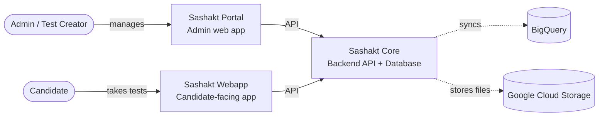

# Sashakt Overview

> _Helping you make assessments easier._

**Sashakt** is an open-source assessment platform that makes it effortless for organizations to create, customize, and conduct assessments at scale.

It exists to solve a familiar problem: after training and capacity-building programs, organizations need a meaningful way to evaluate impact — and participants need a way to reflect on what they've actually learned. Sashakt gives both sides the tools to do that, in low-bandwidth, multi-lingual, multi-region settings.

## Who is Sashakt for?

Sashakt is built for organizations in the government and non-profit ecosystem that run capacity-building programs, trainings, and workshops. Typical users include:

- **Training organizations** measuring learning outcomes before, during, and after their programs
- **Government programs** running large-scale skill or eligibility assessments
- **Non-profits** issuing certifications across multiple geographies
- **Field teams** collecting structured data through dynamic forms
- **Researchers and evaluators** tracking change over time

If you administer assessments, manage a question bank, issue certificates, or need granular control over who can see and do what across regions — Sashakt is built for you.

## What can you do with Sashakt?

- 📝 **Configure multiple question formats** — single-choice, multi-choice, subjective, numerical, and matrix — with images and audio.
- 🏷️ **Tag and classify** questions by topic, skill, region, or any other criteria that matters to your program.
- 🧪 **Combine questions** into custom assessments, tests, and quizzes with sections, timers, and configurable scoring.
- 💾 **Save assessments as reusable templates** or deploy them directly to participants.
- 👥 **Support anonymous or registered participation** with dynamic registration forms tailored per assessment.
- 🏆 **Issue certificates** automatically with designer templates and verifiable tokens.
- 🌐 **Run assessments bilingually** — participants can switch between English and Hindi on the fly.
- 🔐 **Control access by region** with fine-grained roles for State, District, and Organization admins.
- 📊 **Collect and analyze data** with built-in dashboards and BigQuery sync to generate actionable insights.

## How Sashakt is put together

Sashakt is made up of three applications that work together:

| Component | What it does | Who uses it |
|-----------|--------------|-------------|
| **Sashakt Portal** | Admin interface to manage users, questions, tests, certificates, organizations, and view analytics. | Administrators |
| **Sashakt Webapp** | The interface candidates see when they take a test — registration, questions, results, and certificate download. | Candidates |
| **Sashakt Core** | The backend API and database that powers everything. | Both apps connect to it |

You don't need to think about Core day-to-day — it runs quietly in the background. Most of this documentation focuses on the **Portal** (what admins do) and the **Webapp** (what candidates experience).

## Where to next?

:::tip New to Sashakt?
Start with the [Quick Start](./getting-started/quick-start) to log in and find your way around.
:::

- [**Quick Start**](./getting-started/quick-start) — Get logged in and oriented in 5 minutes.
- [**User Roles**](./getting-started/user-roles) — Understand who can do what.
- [**Key Concepts**](./getting-started/key-concepts) — The vocabulary you'll see throughout Sashakt.

If you're not sure where to begin, the Quick Start is the right door.

## About the project

Sashakt is built by [Project Tech4Dev](https://projecttech4dev.org) — an initiative focused on bringing open-source, affordable technology to the social sector. The platform is developed in collaboration with [Veddis Foundation](https://veddis.org) and [Avanti Fellows](https://avantifellows.org).

Learn more about Sashakt at [projecttech4dev.org/sashakt](https://projecttech4dev.org/sashakt), or join the conversation on [Discord](https://discord.com/invite/C7BKvYPufp).
